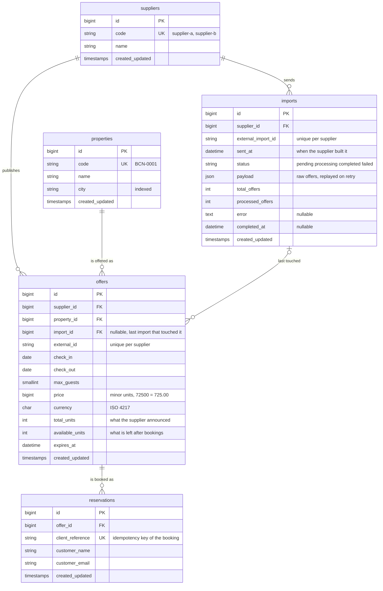

# Booking API

REST API for importing accommodation offers from suppliers, searching the cheapest available
offer per property, and booking it.

Repository: https://github.com/bogdanoff1337/WTGSpain

Laravel 12, PHP 8.2+, MySQL 8, database queue.

## Quick start

Docker is the only requirement. One script builds the image, starts MySQL, installs the
dependencies, generates `APP_KEY`, runs the migrations and the seeder, and starts both the HTTP
server and the queue worker:

```sh
./run.sh
```

```
API      http://localhost:8000/api
Queue    running (docker compose logs -f queue)
```

The PHP container pins PHP 8.2 and `composer.json` pins `config.platform.php = 8.2.0`, so
`composer.lock` resolves identically on every machine regardless of the locally installed PHP.

### `run.sh` commands

```sh
./run.sh              # build, migrate --seed, start app + queue worker
./run.sh fresh        # same, but migrate:fresh --seed first
./run.sh test         # php artisan test on in-memory SQLite (accepts flags: --filter=...)
./run.sh test:mysql   # the same suite against the MySQL 8 container
./run.sh check        # pint + phpstan + tests
./run.sh artisan ...  # any artisan command, e.g. ./run.sh artisan queue:work
./run.sh logs queue   # follow a container's logs
./run.sh down         # stop
./run.sh destroy      # stop and drop the MySQL volume
```

MySQL is published on host port `3307` (`DB_HOST_PORT` in `.env`) to avoid clashing with a local
MySQL on 3306.

## Manual installation (without Docker)

Needs PHP 8.2+ with `pdo_mysql`, Composer and MySQL 8. Running the test suite additionally
needs `pdo_sqlite` (shipped by default in most PHP builds).

```sh
composer install
cp .env.example .env
php artisan key:generate
```

`.env.example` ships `DB_HOST=mysql`, which is the Docker compose service name, so **change it**
to your own MySQL before going further:

```sh
DB_HOST=127.0.0.1
DB_PORT=3306
DB_DATABASE=booking
DB_USERNAME=booking
DB_PASSWORD=your-password
```

```sh
php artisan migrate --seed
php artisan serve       # http://localhost:8000
php artisan queue:work  # required, imports stay `pending` without it
```

## Commands

```sh
composer test      # php artisan test
composer lint      # pint (fix)
composer lint:test # pint (check only)
composer analyse   # phpstan, level 6, larastan
composer check     # all of the above
```

The application, the queue (`QUEUE_CONNECTION=database`) and the seeder all run on MySQL 8 —
no Redis is needed. Tests default to an in-memory SQLite database (`phpunit.xml`) for speed;
`./run.sh test:mysql` runs the identical suite against the MySQL 8 container (`booking_test`),
and it is green there too.

## Database schema



### Keys and indexes

| Table | Index | Why |
|---|---|---|
| `suppliers` | `code` unique | the API addresses suppliers by code, not id |
| `properties` | `code` unique | `firstOrCreate` target when an import arrives |
| `properties` | `city` | the only optional search filter |
| `imports` | `(supplier_id, external_import_id)` unique | **import idempotency** — a repeated POST hits this index instead of creating a row |
| `offers` | `(supplier_id, external_id)` unique | **offer idempotency** — an offer seen again is updated, not duplicated |
| `offers` | `(property_id, check_in, check_out, price)` | serves the correlated "cheapest bookable offer" subquery, and `price` last lets the index also satisfy the `ORDER BY` |
| `offers` | `(check_in, check_out, max_guests)` | serves the `EXISTS` filter that drops properties without a matching offer |
| `reservations` | `client_reference` unique | the same booking request can never be counted twice |

### Foreign keys

| Column | On delete | Reasoning |
|---|---|---|
| `imports.supplier_id` | cascade | dropping a supplier drops its import history |
| `offers.supplier_id` | cascade | an offer cannot outlive its supplier |
| `offers.property_id` | cascade | an offer cannot outlive its property |
| `offers.import_id` | set null | the column only records which import last touched the offer; deleting an old import must not delete live offers |
| `reservations.offer_id` | restrict | an offer with reservations must not be deletable |

### Two counters on `offers`

`total_units` is the supplier's number; `available_units` is what is actually left. Bookings only
ever decrement `available_units`, and a re-import recomputes it as
`max(0, new total_units − already consumed)`. Keeping both means the supplier stays the source of
truth for stock size without a re-import silently handing out a unit that is already booked.

## Endpoints

### `POST /api/imports`

Accepts a supplier payload, stores it, and queues processing. Responds `202 Accepted`.

```json
{
  "supplier": "supplier-a",
  "external_import_id": "import-1",
  "sent_at": "2026-09-10T08:00:00+00:00",
  "offers": [
    {
      "external_id": "offer-1",
      "property": { "code": "property-1", "name": "Sunny Apartment", "city": "Barcelona" },
      "check_in": "2026-10-01",
      "check_out": "2026-10-05",
      "max_guests": 4,
      "price": 12000,
      "currency": "EUR",
      "available_units": 3,
      "expires_at": "2026-09-20T12:00:00+00:00"
    }
  ]
}
```

`price` is an integer in minor units (12000 = 120.00 EUR). `external_id` must be unique inside
one payload (`distinct`), and at most 1000 offers are accepted per request.

### `GET /api/imports/{import}`

Returns the import status: `pending`, `processing`, `completed` or `failed`, together with
`total_offers`, `processed_offers`, `error` and `completed_at`.

### `GET /api/properties`

Query parameters: `check_in`, `check_out`, `guests` (required), `city`, `per_page`, `page`
(optional). Returns paginated properties, each with its cheapest bookable offer.

```sh
curl "http://localhost:8000/api/properties?city=Barcelona&check_in=2026-10-01&check_out=2026-10-05&guests=2"
```

```json
{
  "data": [
    {
      "code": "BCN-0001",
      "name": "Apartment near Sagrada Familia",
      "city": "Barcelona",
      "best_offer": { "id": 125, "supplier": "supplier-a", "price": 72500, "currency": "EUR", "available_units": 2, "expires_at": "2026-09-10T23:59:59+00:00" }
    }
  ],
  "next": "http://localhost:8000/api/properties?city=Barcelona&check_in=2026-10-01&check_out=2026-10-05&guests=2&page=2",
  "prev": null,
  "per_page": 15,
  "current_page": 1,
  "last_page": 2,
  "total": 17
}
```

`next` / `prev` / `per_page` are flattened onto the root by
`PropertyCollection::paginationInformation()` instead of Laravel's default `links` / `meta`
wrappers. The paginator uses `withQueryString()`, so `next` and `prev` carry the search
parameters and can be followed directly.

An offer is bookable when its dates match the search exactly, `max_guests >= guests`,
`available_units > 0` and `expires_at` is in the future.

### `POST /api/offers/{offer}/reservations`

```json
{
  "client_reference": "client-1",
  "customer_name": "Ada Lovelace",
  "customer_email": "ada@example.com"
}
```

Responds `201 Created`, or `409 Conflict` when the offer is sold out, expired, or the
`client_reference` was already used.

## Import idempotency

Three separate mechanisms:

1. `imports` has a unique index on `(supplier_id, external_import_id)`. The import is created
   with `firstOrCreate()`, which internally uses `createOrFirst()` and catches
   `UniqueConstraintViolationException`, so two concurrent identical requests produce one row
   instead of a 500.
2. The job is dispatched only when `$import->wasRecentlyCreated` is true. A repeated request
   returns `202` with the current state and does not queue a second job.
3. `offers` has a unique index on `(supplier_id, external_id)`. An offer that arrives again in a
   later import is updated, not duplicated.

The raw offers are stored in `imports.payload` (JSON), so the queued job carries only the
import id and a retry reuses the same data.

### Stock is not restored by a re-import

`offers` keeps two counters: `total_units` (what the supplier last announced) and
`available_units` (what is left after bookings). A re-import writes
`available_units = max(0, new_total_units − already_consumed)` where
`already_consumed = previous total_units − previous available_units`. So the supplier stays the
source of truth for the stock size, but a unit that is already booked is never handed out twice.
The existing offer row is read with `lockForUpdate()` inside the import transaction, so a
concurrent booking cannot slip between the read and the write.

### Failure handling

Processing of one import runs inside a single `DB::transaction()`: either all offers of the
import are written, or none. `ImportProcessor::process()` catches any `Throwable`, records
`status = failed` plus the error message, and rethrows so the queue still sees a failed attempt.
The job additionally declares `$tries = 3`, `$backoff = [5, 30]`, `$timeout = 120` and
`$failOnTimeout = true`, and its `failed()` hook writes the final failure. A hard `SIGKILL` of
the worker is the one case the application cannot observe; the job is then released back to the
queue by `queue:work` and reprocessed.

## Double booking protection

`ReservationService::reserve()`:

```php
DB::transaction(function () use ($offer, $data) {
    $locked = Offer::query()->whereKey($offer->getKey())->lockForUpdate()->firstOrFail();

    if ($locked->expires_at->isPast()) {
        throw new OfferNotBookableException('This offer has expired.');
    }

    if ($locked->available_units < 1) {
        throw new OfferNotBookableException('This offer has no available units left.');
    }

    $locked->decrement('available_units');

    return $locked->reservations()->create([...]);
});
```

The offer row is re-read inside the transaction with `lockForUpdate()`, which compiles to
`SELECT ... FOR UPDATE` on MySQL. A second concurrent request blocks on that select until the
first transaction commits and then reads the updated `available_units`, so two requests cannot
both pass the check on the last unit. `decrement()` issues
`SET available_units = available_units - 1`, so no previously read value is written back.

`reservations.client_reference` is unique. The `unique` validation rule catches the common case
with a `422`; a race that slips past validation hits the unique index, and the resulting
`UniqueConstraintViolationException` is translated into a `409` by
`DuplicateReservationException` instead of leaking a 500. Because the catch is outside
`DB::transaction()`, the decrement is rolled back before the error is returned.

Note on tests: the suite runs on SQLite, whose grammar drops `FOR UPDATE` (SQLite has no
row-level locking), and `RefreshDatabase` wraps every test in a transaction. Real concurrency is
therefore not reproducible in the suite. What is covered instead:

- with `available_units = 1`, the first request returns `201` and the second `409`, and the
  counter never goes negative;
- when the reservation insert fails on the unique constraint, `available_units` is unchanged,
  which proves the decrement and the insert are in the same transaction and roll back together.

## Cheapest offer query

Selecting the cheapest offer, ordering and pagination happen entirely in SQL:

```sql
select properties.*,
  (select offers.id    from offers where <bookable> and offers.property_id = properties.id
     order by offers.price asc, offers.id asc limit 1) as best_offer_id,
  (select offers.price from offers where <bookable> and offers.property_id = properties.id
     order by offers.price asc, offers.id asc limit 1) as best_offer_price
from properties
where city = ? and exists (select * from offers where <bookable> and offers.property_id = properties.id)
order by best_offer_price asc, properties.id asc
limit ? offset ?
```

`best_offer_id` is consumed by `Property::bestOffer()`, declared as
`belongsTo(Offer::class, 'best_offer_id')`, so the offer and its supplier are eager loaded.
The relation is only meaningful on rows produced by `PropertySearchService`, which is the only
place that selects the `best_offer_id` column. One page costs four queries: count, page, offers,
suppliers — no PHP-side grouping and no N+1.

`HasOne::ofMany()` was not used. Its constraints are fixed when the relation is declared, but
the filters here come from the request. Passing them through
`with(['bestOffer' => fn ($q) => ...])` would apply them after the minimum was chosen, so the
subquery would return the globally cheapest offer and the outer filter would then discard it,
hiding a property that does have a matching offer.

Supporting indexes on `offers`: `(property_id, check_in, check_out, price)` for the correlated
subqueries and `(check_in, check_out, max_guests)` for the search filter. `properties.city` is
indexed for the city filter.

## Decisions and assumptions

- **Date matching is exact.** `offers.check_in = ?` and `offers.check_out = ?`. This is the
  literal reading of the requirement and keeps the query sargable, unlike `whereDate()`, which
  wraps the column in `date()` on MySQL and disables the index.
- **`check_in` / `check_out` are not cast to dates.** With a `date` cast, Eloquent writes
  through `fromDateTime()` using the connection format `Y-m-d H:i:s` (the cast format is
  ignored). MySQL truncates that in a `DATE` column, SQLite stores it verbatim, so exact date
  matching would behave differently in tests and in production. They are stored as `Y-m-d`
  strings, normalised once in `ImportProcessor`.
- **`$casts` is declared as a property, not as a `casts()` method.** Larastan reads the
  property; with the method it infers `string` for `payload`, `sent_at` and `completed_at`.
- **An unknown supplier returns 422, not 404.** `supplier` is a body field, validated with
  `exists:suppliers,code`. `404` is used where a resource is addressed in the URL:
  `GET /api/imports/{import}` and `POST /api/offers/{offer}/reservations`.
- **Money is stored as an integer in minor units** with a separate `currency` column.
- **Columns inside the correlated subquery are table-qualified** (`offers.check_in`, …) so the
  subquery can never become ambiguous against the outer `properties` row.
- **Offer deletion.** `offers.import_id` is nullable with `nullOnDelete` (it records the last
  import that touched the offer, deleting an old import must not remove current offers).
  `reservations.offer_id` uses `restrict`, so an offer with reservations cannot be deleted.

## Structure

```
app/Enums/ImportStatus.php
app/Exceptions/                OfferNotBookableException, DuplicateReservationException
app/Http/Controllers/          ImportController, PropertyController, ReservationController
app/Http/Requests/             StoreImportRequest, SearchPropertiesRequest, StoreReservationRequest
app/Http/Resources/            ImportResource, PropertyCollection, PropertyResource, OfferResource, ReservationResource
app/Jobs/ProcessImport.php
app/Models/                    Supplier, Property, Import, Offer, Reservation
app/Services/                  ImportService, ImportProcessor, PropertySearchService, ReservationService
database/migrations/
database/factories/
database/seeders/              SupplierSeeder (supplier-a, supplier-b)
tests/Feature/                 ImportTest, PropertySearchTest, ReservationTest
Dockerfile, docker-compose.yml, run.sh
```

Controllers only validate, delegate and serialise. Business logic lives in `app/Services`.
Queries that belong to a model live on the model (`Offer::scopeBookable()`).

## Environment

`.env.example` contains no secrets — `APP_KEY` is empty and the only credentials are the local
Docker MySQL defaults (`booking` / `secret`), which exist nowhere but on the developer machine.
`QUEUE_CONNECTION=database` by default; the `jobs`, `job_batches` and `failed_jobs` tables are
created by the migrations.
